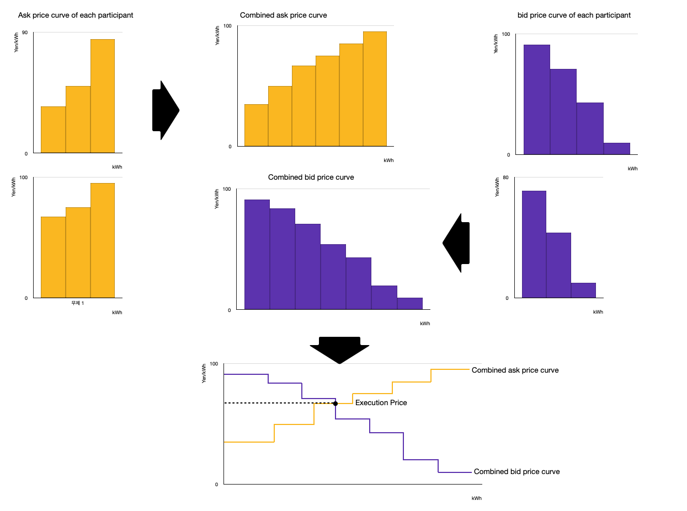

# Single-price Auction

Single-price Auction is a pricing method of auction by deciding a single execution price. Unlike Multi-price Auction, this method makes consumers and producers trade the goods at a single price.

## How to set the price

In Single-price Auction, we investigate the bid/ask price of each participant. Then, we combine every bid/ask price curve and align them on the same graph individually. Following the supply-demand curve, we put each bar in a row.

picture 1.

The intersection point is an equilibrium point and also is execution price. Every trade on this Single price auction will be traded on the price of this point. The prices on the left side of the intersection point would be dragged to the intersection point so that they can trade on a single price, while the prices on the right side of the point will be declined.

## Advantage of single price auction

The very advantage of Single-price auction is that every consumer and producer on this trade can derive benefit.
On the left side of the point, consumers can buy goods cheaper than they bid, while producers can sell their goods at higher prices than the price they asked.
However, in the case of the right of the intersection point, since consumers are trying to buy goods cheaper than the equilibrium price and producers are trying to sell goods more expensive than the equilibrium price, the deals are declined.

By applying Single-price Auction, every participant on this deal can get a good share.
