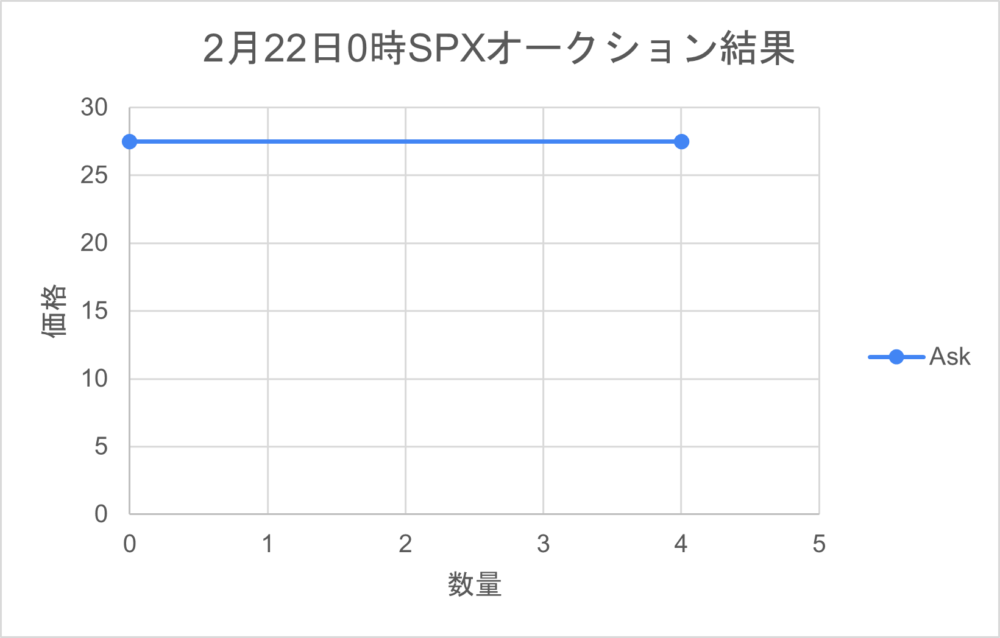
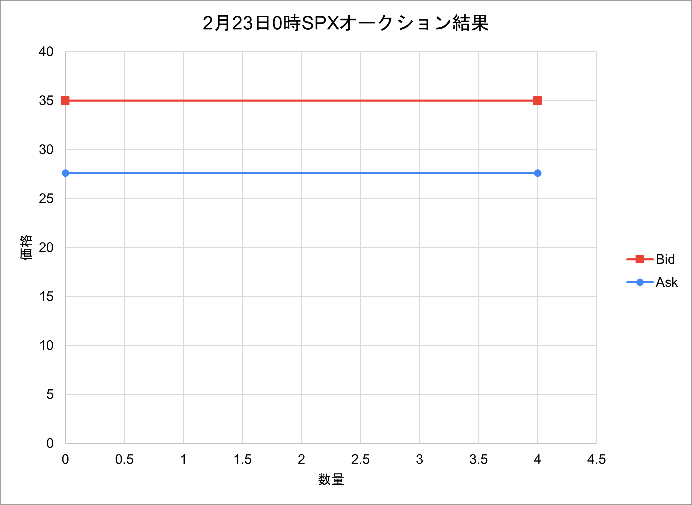

# EDISON テスト 2022/02/22-25

## 概要

2022/02/21 - 25 において、京都大学ソーシャルイノベーションセンターの学生 5 名による電力使用管理アプリ EDISON の動作確認テストを実施しました。

5kWh/day を標準的な電気使用量と想定し、前月の使用量データとしてデータベースに記録しました。このデータを参考に 5 名の学生の電気使用量を以下のものとし、テストの途中で UPX トークンが不足するシナリオを想定しております。

取引については毎日 0 時に前日の買い注文（Bid）と売り注文（Ask）を、シングルプライスオークション方式で処理する形式で行います。
参加者の注文に加え、システムは参加者の残高不足分の UPX と 4SPX の売り注文を発行しています。

## 想定

テスト開始時、標準的な電気使用量であればテスト期間でちょうどなくなる量のトークンである 25UPX を付与します。
一方でテストに参加した学生の電気使用量と日々の市場での行動を以下のようにします。

- 佐田：前月の 3 倍の電力量を消費する。毎日 6 回 UPX トークンを購入する。
- 楠本，新藤：前月とほぼ同じ電力量を消費する。毎日，UPX トークンの購入を 2 回と販売を４回行う。
- 大木：前月の 2 倍の電力量を消費する。UPX トークンの購入と販売を毎日 3 回ずつ行う。
- ゼルダ：前月とほぼ同じ電力量を消費する。できるだけ多く太陽光発電の SPX トークンを購入する。第 2 日に，実際の太陽光発電の電力量相当以上の SPX トークンを購入しようとする。

## 取引の状況

### 21 日

9 時 30 分ごろ、テストに参加する学生 5 名に加えて、取引を一切しないアカウントの計 6 アカウントが作成されました。
この際、25UPX を付与する予定でしたが、設定ミスにより 15UPX しか付与されていませんでした。そのため、10UPX を 22 日の夕方に補填しております。

10 時に電気使用量が各々の UPX 残高より引き落とされました。
次のオークションは 22 日の 0 時に行われるため、学生はオークションに向けた売り注文と買い注文を作成しました。

### 22 日

UPX は 33 円、10UPX が約定しました。最初の発行価格が 27 円なのでかなり市場がインフレしている状況だと考えられます。
それなりの買い注文がありましたが、進藤さんの 35 円 10UPX の買い注文が大きく、全ての売り注文を吸収しました。一方で、35 円の買い注文がすべて決済されたことで、約定価格はひとつ下の買い注文の価格が参照され、33 円となりました。
33 円の買い注文は佐田さんのものでしたが、次の売り注文は進藤さんの 36 円だったため、成約しないという珍しい結果となりました。
グラフは以下のとおりです。

SPX はゼルダさんが買う予定でしたが、入札が取り消されており取引はありませんでした。（もし仮に取り消されなかった場合にも 27 円だったため、27.5 円のシステムの売り注文に届かないので成約はしていません。）

22 日の朝に 2 度目の電気使用引き落としが発生し、トータルの残高は 20UPX となりました。残高不足の学生が 2 名、合計 20kWh 発生したため、20UPX の売り注文がシステムより追加発行されました。

この残高不足が想定より早かったことから初日の UPX トークン付与数が 10UPX 少なかったことが発覚したため、19 時ごろ、参加者全員に対し、システムより 10UPX を追加で送付しました。

### 23 日

UPX は 35 円で 24UPX が、SPX も同じく 35 円で 4SPX が約定しました。前日の約定価格のみが参加者に情報として与えられている状態のため、昨日の価格を参考にそれぞれが入札したものと思われます。
詳細には大木さんが高額の Bid を複数行っており、同様に高値をつけていた佐田さんと合わせて 2 名の買い注文が約定しました。大木さんの 35 円の Bid は一部が約定し、一部が約定しないという結果になっています。

忘れていたのか、十分な UPX を持っていたので買い控えたのかは不明ですが、昨日 10UPX を購入した新藤さんはこの日は買い注文が見られませんでした。
この 2 日間、楠本さんは買い注文はありましたが、2 日とも成約していない状況です。

SPX については 35 円で 4SPX が約定しました。下の図が受給線になりますが、この日についてはゼルダさんの Bid の価格が優先され、35 円が約定価格となっています。

### 24 日

UPX は 35 円で 23UPX が、SPX は 27.6 円で 4SPX が約定しました。

SPX の取引については 23 日の状況とほぼ同じですが、この日はシステムの Ask の価格が優先され、27.6 円が約定価格となっています。

電気使用量の多い佐田さんの残高不足がかなり大きくなってきており、この日のシステムからの売り注文が 35UPX になりました。一方で参加者全体で UPX トークン数は 52 であり、参加者のトークン保有にかなりの格差があることがうかがえます。

### 発見された不具合

- Insufficient Balance の表示 → 修正済
- システムより発行される UPX の売り注文の形式が PrimaryAdditional(追加発行)ではなく、Secondary(二次流通) となっていた → 修正済
- 毎日 0.1 円ずつ上がっていくトークンの発行価格が何故か 27.200000000000003 円といった数字になる。27.400000000000006 になっていたため、2 回 0.1 を加えたときに内部的に 0.000000000000003 追加されている？

### リリースに当たって確認すべき項目

- 関西電力の従量電灯 A の最も高額な電気料金である 3 段階目（300kWh 超過分）の価格が 28.7 円であることを考えてもテスト期間中の UPX 取引価格が高すぎると思われる。PrimaryTransaction として 27 円での購入履歴を表示していたが、これに加えて 1kWh あたり 27 円前後が電気料金の相場であることをどこかに明記したほうがよいかもしれない。
- 当初、全体の UPX トークン<全員の不足トークンの合計の場合のみ、UPX の追加発行を行う形だったが、慢性的なトークン不足が予想されるため、全員の不足トークンの合計を毎日発行する形に改めた。この設定で発行トークン数が多くなりすぎないか検証の必要あり。
