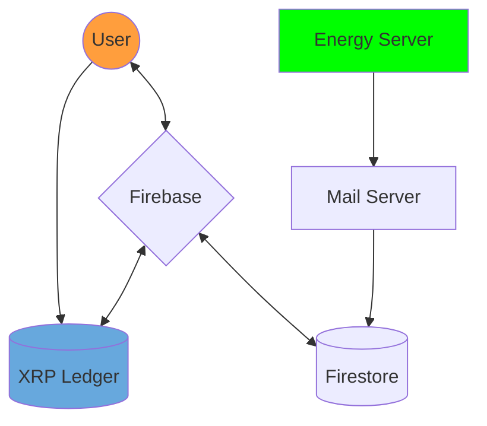

# ハードウェア構成図

```mermaid
flowchart
style User fill:#ff9e3d
style XRPL fill:#67a8dd
style ES fill:#00ff00


User((User)) <--> Fn{Firebase}
User --> XRPL[(XRP Ledger)]
Fn<-->XRPL
Fn <-->DB[(Firestore)]
ES[Energy Server] --> MS[Mail Server]-->DB
```

