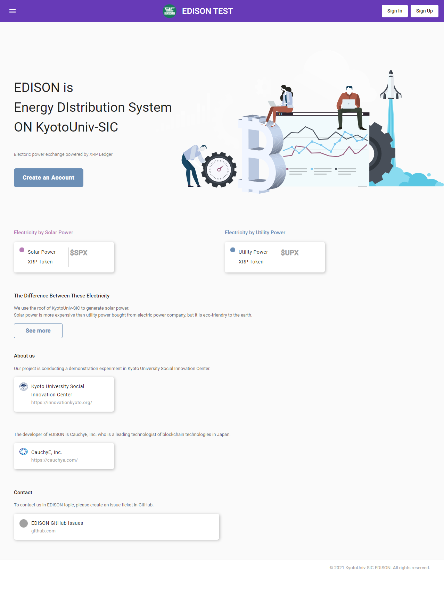
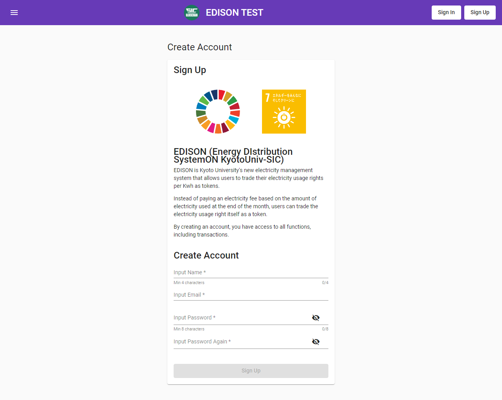
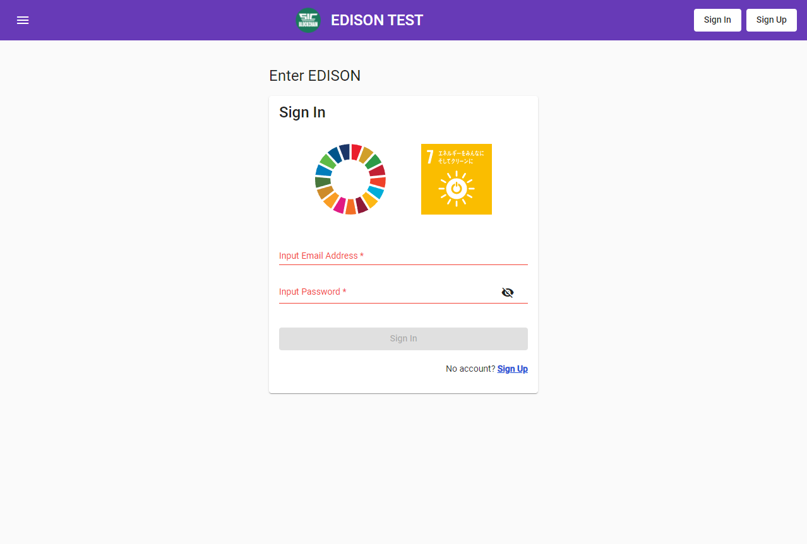
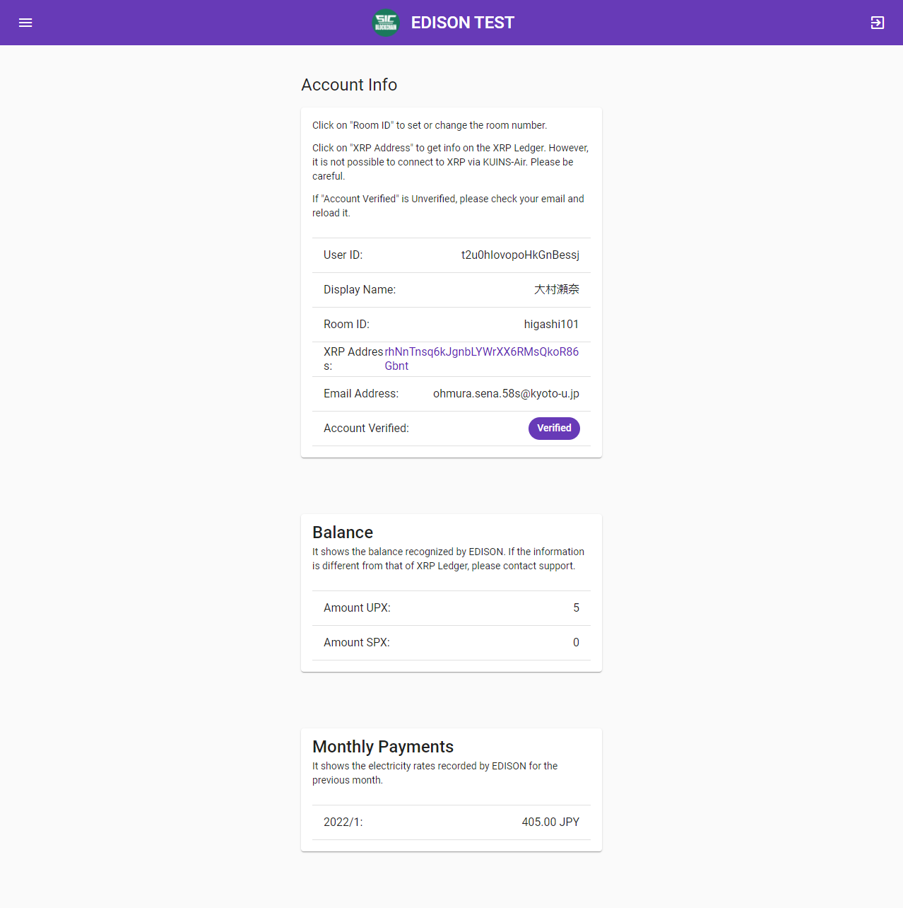
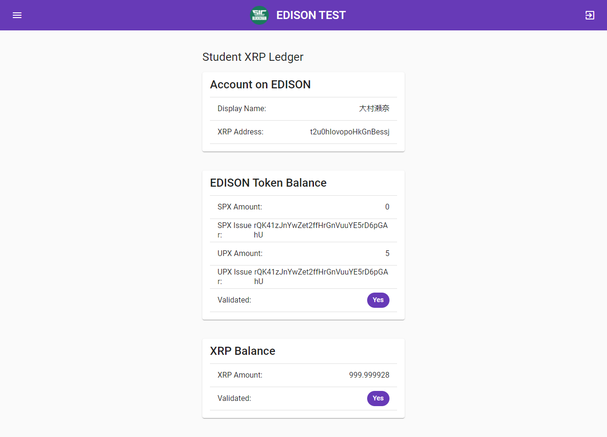
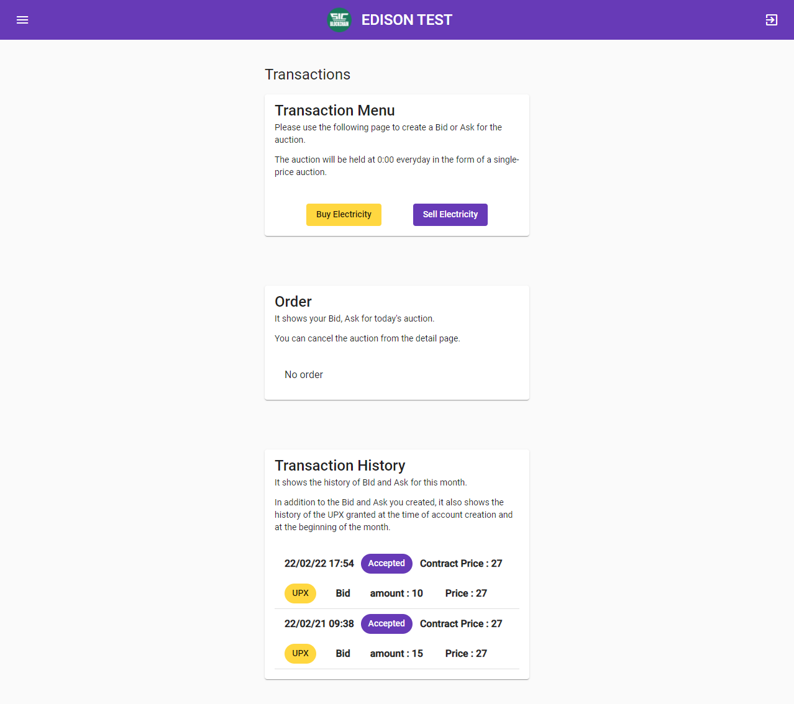
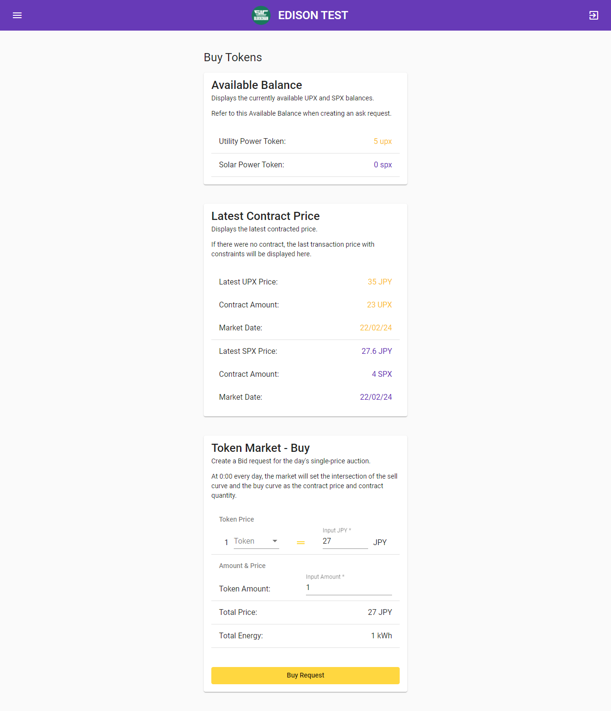
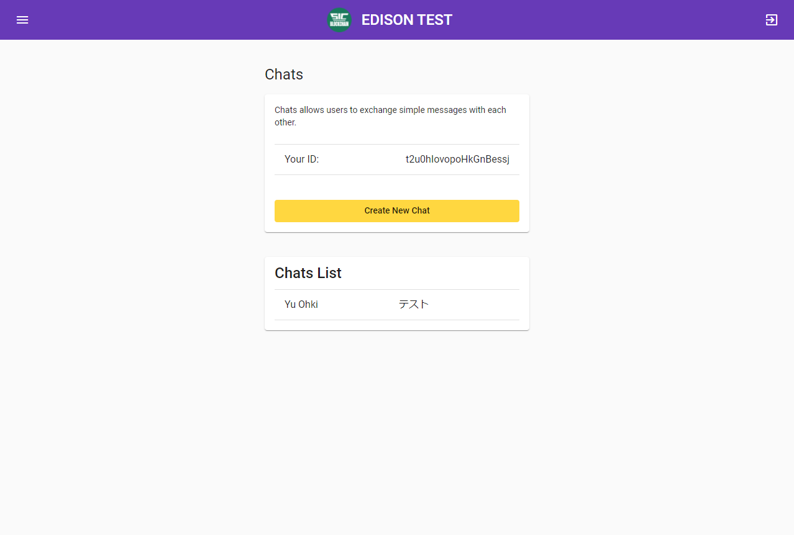
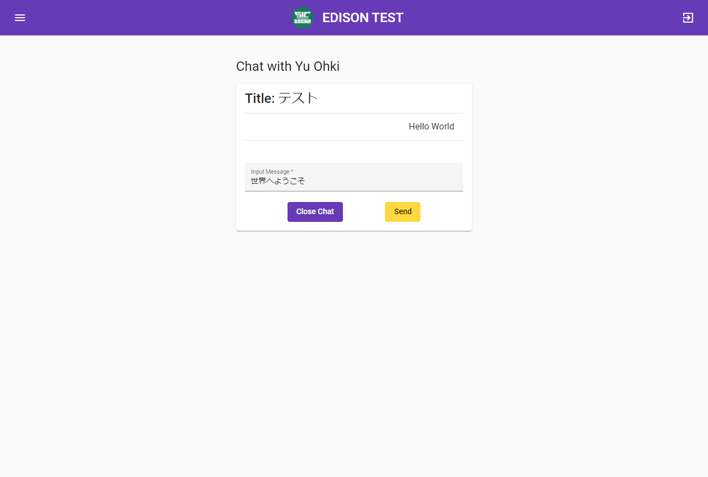
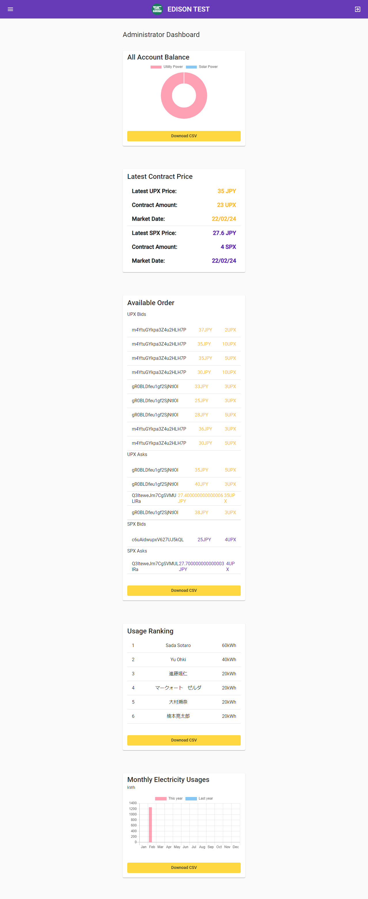

# EDISON 主要画面

2022/02/25 [株式会社 CauchyE](https://cauchye.com/) 大村瀬奈 作成

## トップページ

EDISON プロジェクトのランディングページです。ソーシャルイノベーションセンター、CauchyE の WEB サイト、GitHub ページのリンクに加え、EDISON の簡単な説明を記載しています。

## 登録画面

アカウント作成画面です。名前（4 文字以上なら大体の形式が可能）、メールアドレス、パスワードを入力してアカウントを作成するためのページです。ログインしていない場合は上のヘッダーから、また、トップページのリンクからもアクセス可能です。

## ログイン画面

すでにアカウントを作成している場合、ログインするためのページです。ログインしていない場合は上のヘッダーからアクセス可能です。メールアドレスとパスワードを入力してログインします。

## アカウントの機能

### アカウント管理画面

アカウントの情報、残高に加え、今までの電気料金の月額を確認できるページです。
Room ID をクリックすると部屋番号を設定するページに、XRP Address をクリックすると次項の XRP Ledger のページに遷移します。

### XRP Ledger

現在ログインしているアカウントの XRP Ledger ブロックチェーン上に記録されている情報をリアルタイムで取得するページです。
KUINS のセキュリティルールの問題で KUINS-Air 経由では情報の取得ができません。

- Account on EDISON
  EDISON に記録されている XRP Adress の情報
- EDISON Token Balance
  どのくらいの量の UPX・SPX を保有しているか
- XRP Balance
  成約した取引を実行する際に手数料として使用される XRP の残高
  ごく少量の XRP が使用されます。

## ダッシュボード

EDISON における重要な情報を一括で閲覧できるダッシュボードのページです。
以下の項目についてこのページで確認することができます。

- 現在のアカウントの残高
- 直近の取引価格
- 今月の電気使用量（個人・全体）
- 電気使用量のランキング
- 保有しているトークンの割合（個人・全体）
- 月間の電気使用量の推移（前年・本年）

## トランザクション画面

### トランザクション一覧

トークンの売り注文・買い注文を行うページへのリンクに加え、以下の情報を確認することが可能なページです。

- 本日の注文

  - 売り注文
  - 買い注文

- 今までの注文の履歴
  - 売り注文（成約したのかどうか）
  - 買い注文（成約したのかどうか）
  - 月初のトークン付与

各注文や注文の履歴をクリックすることで詳細な情報を表示するページに遷移します。注文は取り消すことも可能です。

### 買い注文画面

買い注文を行うことができるページです。自分が今回の取引で利用可能な残高（UPX, SPX, ある場合は残高不足）と最新の取引価格が表示され、トークンの種類と価格、数量を決めて売り注文を発行できます。

### 売り注文画面

売り注文を行うことができるページです。表示されている内容は買い注文のページと同様ですが、電力使用量に相当する残高引き落としの都合で、0-11 時は売り注文を行う事ができません。

## 通知画面

### 一覧画面

自分宛てのメッセージの一覧画面です。
メッセージのタイトルと宛先の確認と新規メッセージの作成が可能です。

### 詳細画面

メッセージの詳細画面です。いままでのメッセージのやり取りの確認が可能です。メッセージへの返信やメッセージのクローズもこの画面で行います。

## 管理者画面

### ダッシュボード（管理者）

EDISON の 管理における重要な情報を一括で閲覧できる管理者用のダッシュボードのページです。情報については Download CSV ボタンにより CSV 形式でのダウンロードも可能です。
以下の項目についてこのページで確認することができます。

- EDISON のすべてのアカウントの合計残高
  - Download CSV で個別の残高情報を取得可能
- 直近の取引価格
- 現在の入札状況
  - Download CSV ですべての入札の詳細な情報を取得可能
- 電気使用量のランキング
- 月間の合計電気使用量の推移（前年・本年）
  - Download CSV で詳細な使用量情報を取得可能

### XRP Ledger（管理者）

管理者アカウントの XRP Ledger ブロックチェーン上に記録されている情報をリアルタイムで取得するページです。
以下の内容について表示されています。
KUINS のセキュリティルールの問題で KUINS-Air 経由では情報の取得ができません。

- EDISON Token Hot Wallet Balance
  システムがあと、どのくらいのトークンを発行できるか
- EDISON Token Cold Wallet Balance
  誰がどのくらいの量の UPX・SPX を保有しているか
- XRP Hot Wallet Balance
  学生との間でシステムが取引をする際に手数料として使用される XRP の残高
- XRP Cold Wallet Balance
  トークンを追加発行する場合に手数料として使用される XRP の残高

