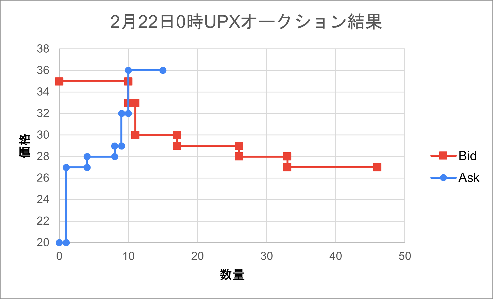
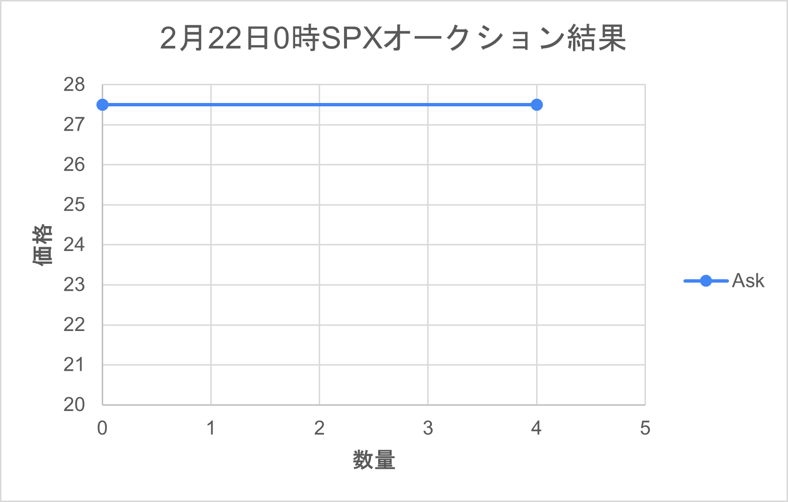
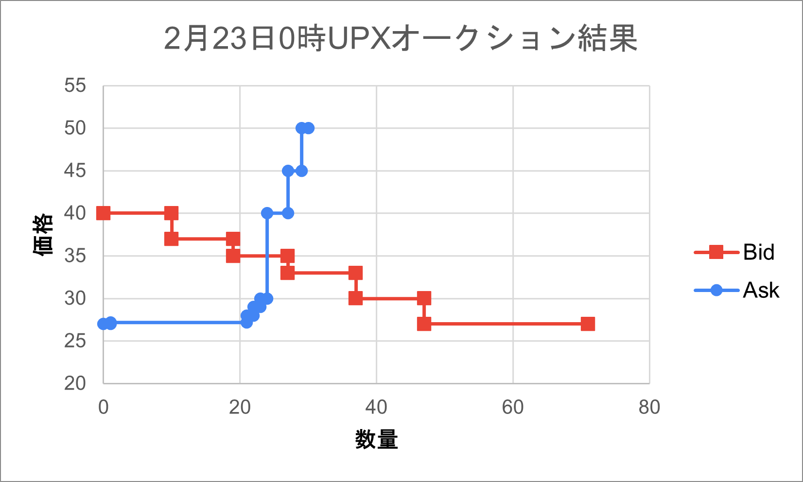
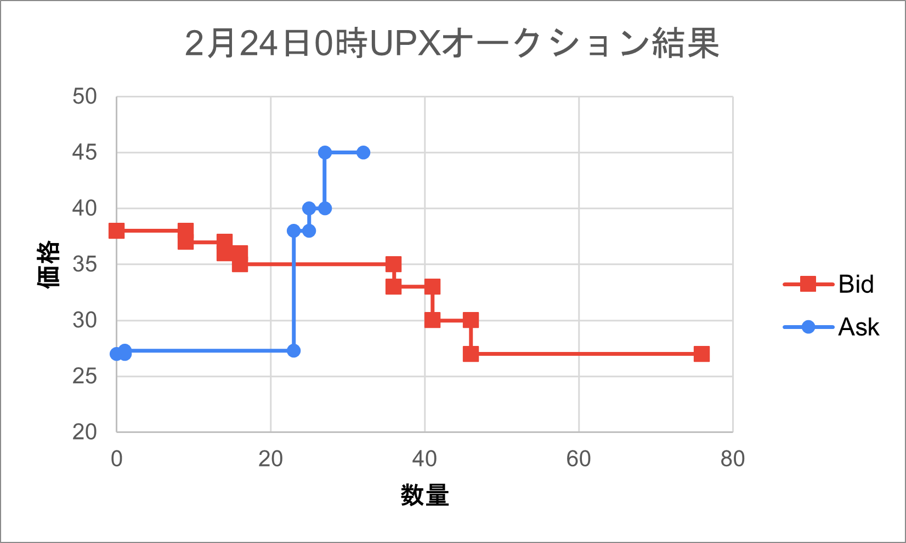
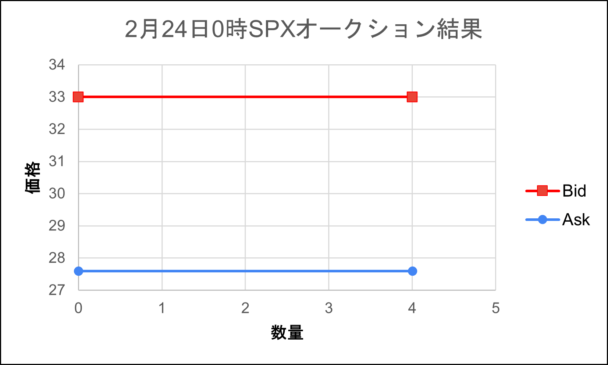
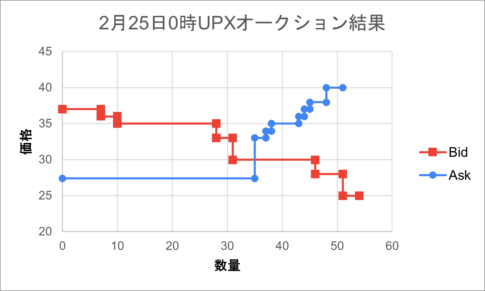
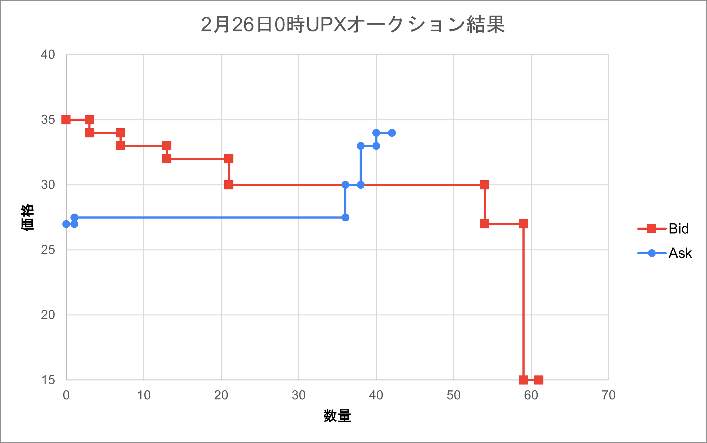
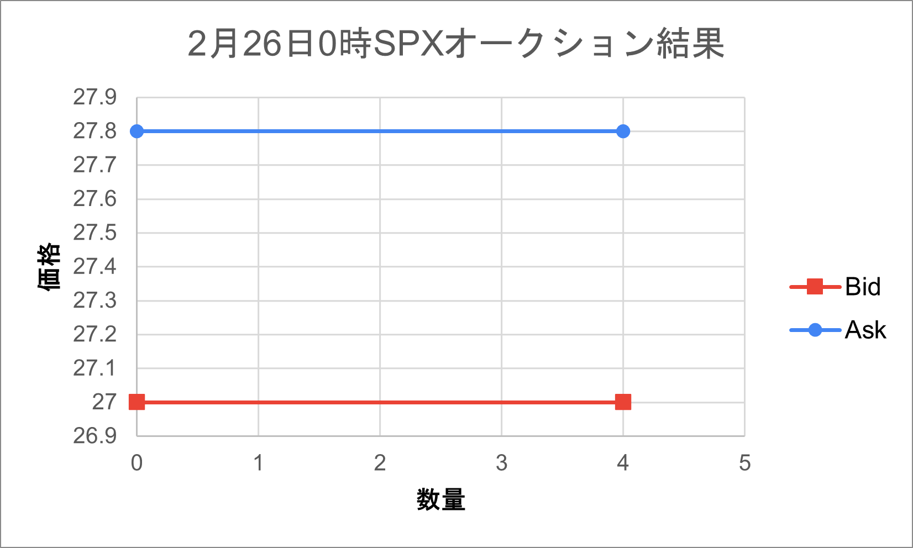

# EDISON テスト 2022/02/22-25

2022/02/27 [株式会社 CauchyE](https://cauchye.com/) 大村瀬奈 作成

## 概要

2022/02/21 - 25 において、京都大学ソーシャルイノベーションセンターの学生 5 名による電力使用管理アプリ EDISON の動作確認テストを実施しました。

5kWh/day を標準的な電気使用量と想定し、前月の使用量データとしてデータベースに記録しました。
このデータを参考に 5 名の学生の電気使用量を以下のものとし、テストの途中で UPX トークンが不足するシナリオを想定しております。

取引については毎日 0 時に前日の買い注文（Bid）と売り注文（Ask）を、シングルプライスオークション方式で処理する形式で行います。
参加者の注文に加え、システムは参加者の残高不足分の UPX と 4SPX の売り注文を発行しています。

## 想定

テスト開始時、標準的な電気使用量であればテスト期間でちょうどなくなる量のトークンである 25UPX を付与します。
一方でテストに参加した学生の電気使用量と日々の市場での行動を以下のようにします。

- 佐田：前月の 3 倍の電力量を消費する。毎日 6 回 UPX トークンを購入する。
- 楠本，新藤：前月とほぼ同じ電力量を消費する。毎日，UPX トークンの購入を 2 回と販売を４回行う。
- 大木：前月の 2 倍の電力量を消費する。UPX トークンの購入と販売を毎日 3 回ずつ行う。
- ゼルダ：前月とほぼ同じ電力量を消費する。できるだけ多く太陽光発電の SPX トークンを購入する。第 2 日に，実際の太陽光発電の電力量相当以上の SPX トークンを購入しようとする。

## 取引の状況

### 21 日

9 時 30 分ごろ、テストに参加する学生 5 名に加えて、取引を一切しないアカウントの計 6 アカウントが作成されました。
この際、25UPX を付与する予定でしたが、設定ミスにより 15UPX しか付与されていませんでした。そのため、10UPX を 22 日の夕方に補填しております。

10 時に電気使用量が各々の UPX 残高より引き落とされました。
次のオークションは 22 日の 0 時に行われるため、学生はオークションに向けた売り注文と買い注文を作成しました。

### 22 日

UPX は 33 円、10UPX が約定しました。最初の発行価格が 27 円なのでかなり市場がインフレしている状況だと考えられます。
それなりの買い注文がありましたが、新藤さんの 35 円 10UPX の買い注文が大きく、全ての売り注文を吸収しました。
一方で、35 円の買い注文がすべて決済されたことで、約定価格はひとつ下の買い注文の価格が参照され、33 円となりました。
33 円の買い注文は佐田さんのものでしたが、次の売り注文は新藤さんの 36 円だったため、成約しないという珍しい結果となりました。
グラフは以下のとおりです。

SPX はゼルダさんが買う予定でしたが、入札が取り消されており取引はありませんでした。（もし仮に取り消されなかった場合にも 27 円だったため、27.5 円のシステムの売り注文に届かないので成約はしていません。）

22 日の朝に 2 度目の電気使用引き落としが発生し、トータルの残高は 20UPX となりました。
残高不足の学生が 2 名、合計 20kWh 発生したため、20UPX の売り注文がシステムより追加発行されました。

この残高不足が想定より早かったことから初日の UPX トークン付与数が 10UPX 少なかったことが発覚したため、19 時ごろ、参加者全員に対し、システムより 10UPX を追加で送付しました。

### 23 日

UPX は 35 円で 24UPX が、SPX も同じく 35 円で 4SPX が約定しました。
前日の約定価格のみが参加者に情報として与えられている状態のため、昨日の価格を参考にそれぞれが入札したものと思われます。
詳細には大木さんが高額の Bid を複数行っており、同様に高値をつけていた佐田さんと合わせて 2 名の買い注文が約定しました。
大木さんの 35 円の Bid は一部が約定し、一部が約定しないという結果になっています。

忘れていたのか、十分な UPX を持っていたので買い控えたのかは不明ですが、昨日 10UPX を購入した新藤さんはこの日は買い注文が見られませんでした。
この 2 日間、楠本さんは買い注文はありましたが、2 日とも成約していない状況です。

SPX については 35 円で 4SPX が約定しました。下の図が受給線になりますが、この日についてはゼルダさんの Bid の価格が優先され、35 円が約定価格となっています。

### 24 日

UPX は 35 円で 23UPX が、SPX は 27.6 円で 4SPX が約定しました。システムからの売り注文のほか、楠本さんから何故か 27 円の Ask があったため、これらが約定しています。
購入は楠本さん、大木さん、佐田さんの順に多く、佐田さんが電気使用量に対して購入数が少なく、トークン不足が進んでいます。
新藤さんはこの日も注文が見られませんでした。

SPX の取引については 23 日の状況とほぼ同じですが、この日はシステムの Ask の価格が優先され、27.6 円が約定価格となっています。

電気使用量の多い佐田さんの残高不足がかなり大きくなってきており、この日のシステムからの売り注文が 35UPX になりました。
一方で参加者全体で UPX トークン数は 52 であり、参加者のトークン保有にかなりの格差があることがうかがえます。

### 25 日

UPX は 30 円で 35UPX が約定しましたが、SPX の約定はありませんでした。システムが発行している Ask のみが約定し、学生の Ask は高値であったため、約定しませんでした。
また、この日の成約した売り注文は前日と同じく、佐田さん、楠本さん、大木さんの 3 名のものでしたが、佐田さんのものが突出して多く約定しています。
新藤さんはこの日も注文が見られませんでした。

SPX については昨日より 0.1 円高い 27.7 円の売り注文がシステムより発行されましたが、ゼルダさんの Bid は 25 円と低かったため、成約なしとなりました。

昨日、佐田さんの残高不足が 30UPX となっていましたが、本日大量に（24UPX）購入できたため、残高が 9UPX、30 残高不足 まで回復しています。
その他の参加者も概ね、1 桁の UPX を保有している状況で、大木さんが 13UPX と 5 残高不足、ゼルダさんは 8UPX、新藤さんが 5UPX、楠本さんが 7UPX とほぼ横並びで終わりました。

26 日は最後のシングルプライスオークションがありますが、このままだと佐田さんが計 21 不足している以外、残高を各々が保有した状態で精算となる予定です。

### 26 日

UPX は 30 円で 38UPX が約定しましたが、SPX の約定はありませんでした。
システムからの売り注文のほか、新藤さんから 27 円数量 1 の Ask と 30 円数量 2 の Ask があったため、これらが約定しています。
買い注文の約定は佐田さん、新藤さん、楠本さんの順に多く、初日以来の新藤さんの買い注文がありました。

SPX については昨日より 0.1 円高い 27.8 円の売り注文がシステムより発行されましたが、ゼルダさんの Bid は昨日同様に 27 円と低かったため、成約なしとなりました。

このオークション終了後のテスト参加のトークン残高は以下の通りとなりました。

- 佐田: 34UPX, 0SPX, 30 不足
- 楠本: 13UPX, 0SPX
- 新藤: 9UPX, 0SPX
- 大木: 13UPX, 0SPX, 5 不足
- ゼルダ: 8UPX, 0SPX
- CauchyE: 0UPX, 0SPX

また、この残高と取引記録を基に清算が 0 時のオークションのあと、即実行されました。
以下が算出された各々の電気料金です。
1kWh あたり 27 円とした本来の電気料金を括弧内に記載しております。

- 佐田: 1523.1964726631393 円（2025 円）
- 楠本: 510.3885361552028 (675 円)
- 新藤: 577.1920634920634 円 (675 円)
- 大木: 1616.3929453262786 円 (1350 円)
- ゼルダ: 691.7929453262786 円 (675 円)
- CauchyE: 675 円 (675 円)

結果としては高額で購入したトークンを多く保有し、清算時に割引価格で決済された大木さんと、価格の高い SPX を 2 度のみ購入したゼルダさんの電気料金が通常より高くなる一方で、他の人は低くなるという結果になりました。
すべてのユーザーの合計値がもともとより少し低くなるのは大学が電力会社に支払う電気代を 27 円/kWh より低い値にしているためです。
前月と同量の電気を使用し、全く取引をしていないユーザーの料金には変化がなく、トークンを多く残して清算を迎えたユーザーは割引の分、実際よりも損をするという当初のデザイン通りに動作していると考えられます。

### 学生からのフィードバック

- トランザクションの結果売り買いしたトークンの総量がわかりにくい。
  - 現在、個別の約定の状況しかわからず、ひと目で分かる前日のトランザクションの合計は表示していません。実装にあたり、必要な機能と思われます。
- 実際に研修施設に対して、EDISON が導入された場合に、全員が頻繁に EDISON をウェブブラウザから確認することは考えづらいため、トークン残高がなくなりそうなときにメール等で連絡する機能等があればよいと思った。
  - 引き落とし後、UPX と SPX の合計が 5 未満の場合、毎日メールで通知する機能はあると良いかもしれません。
- 「Available Balance」で一度 Insufficient Balance が 5 になってから（第 1 日）、UPX を購入しても Insufficient Balance が 5 のままであった。
  UPX と SPX power token に Insufficient Balance を差し引いた数を表示し、Insufficient Balance は 0 と表示したほうが良いのではないか
  - これは XRP Ledger がマイナスの値を処理できないため、Insufficient Balance は EDISON で固有で管理しているためです。
    もし、差し引く場合、XRP Ledger との整合性が取れなくなるため、この仕様が現実的だと考えています.
- チャット機能に関して、学生間のやりとりは LINE 等で行われているので、あまり使用用途が無いように思った。
  - Chat 機能は管理者から学生にメッセージを送るための機能のみとして、学生間のやり取り機能は削除して良いのかもしれません。
- Usage ranking について、人によっては実名で自分の電気使用量が記載されることに抵抗感があると思われる。そのため、匿名で記載した方が良いと思った。

  - 今回は Account ID ではわかりにくいかと思い、name を表示しました。管理者のダッシュボードのみ実名とし、学生のダッシュボードは ID で表示するといった配慮は可能です。

- トランズアクションの画面などに、UPX・SPX の残高の横に、自分が現在使える円の総額の表示があると、より使いやすいのではと思いました。
  - 円については残高があるわけではなく、月末の精算まで関わってこないので、無制限に使用することが可能です。
    シングルプライスオークション形式なので間違えて高額で入札した場合でも、その価格で約定する確率はかなり低いです。
- 特に初日に、いくらで売り買いすればいいのかがわかりにくかったため、1kwh がおおよそいくらなのかなど、UPX を売買する際に目安になるものが、latest contract price 以外にあるとよいと思いました。
  - 今回のテストでは実際の電気料金よりも高額な取引が目立ちました。
    入札画面の初期の値や PrimaryTransaction（システムからの付与）を 27 円にしていたので大丈夫かと思っていましたが、それだと不足していることがわかったので、電気料金をもっと明確にする必要があります。
- 学生が皆今回のシナリオのように毎日アクティブに売買をするとはあまり考えられないため、必要であれば何かしらのインセンティブが必要なのではと思いました。
  - 手間がかかる上に、取引の状況次第では今までより電気料金が高くなるリスクもあるため、インセンティブデザインについては要検討だと思います。

### 発見された不具合

- Insufficient Balance の表示 → 修正済
- システムより発行される UPX の売り注文の形式が PrimaryAdditional(追加発行)ではなく、Secondary(二次流通) となっていた → 修正済
- 毎日 0.1 円ずつ上がっていくトークンの発行価格が何故か 27.200000000000003 円といった数字になっています。27.400000000000006 になっていたため、2 回 0.1 を加えたときに内部的に 0.000000000000003 追加されていると思われます。
- 月末清算の発火条件に問題があり、うまく動作しなかった → 今回のテストでは後から発火させることで対応しました。原因となった設定について調査中です
- 最終日の清算の際に付与されたトークン数が前月の実際の使用量とズレているユーザーが存在する。 → 何か計算漏れがある可能性があり、調査中です。

### リリースに当たって確認すべき項目

- 関西電力の従量電灯 A の最も高額な電気料金である 3 段階目（300kWh 超過分）の価格が 28.7 円であることを考えてもテスト期間中の UPX 取引価格が高すぎると思われます。
  PrimaryTransaction として 27 円での購入履歴を表示していたが、これに加えて 1kWh あたり 27 円前後が電気料金の相場であることをどこかに明記したほうがよいかもしれません。
- 当初、全体の UPX トークン<全員の不足トークンの合計の場合のみ、UPX の追加発行を行う形だったが、慢性的なトークン不足が予想されるため、全員の不足トークンの合計を毎日発行する形に改めました。
  この設定で発行トークン数が多くなりすぎないか検証の必要があります。
- SPX を購入する環境意識の高いユーザーに与えるインセンティブが不十分だと思われます。
  アクションがない状態よりも料金が高くなるため、追加の施策が必要かと思います。
