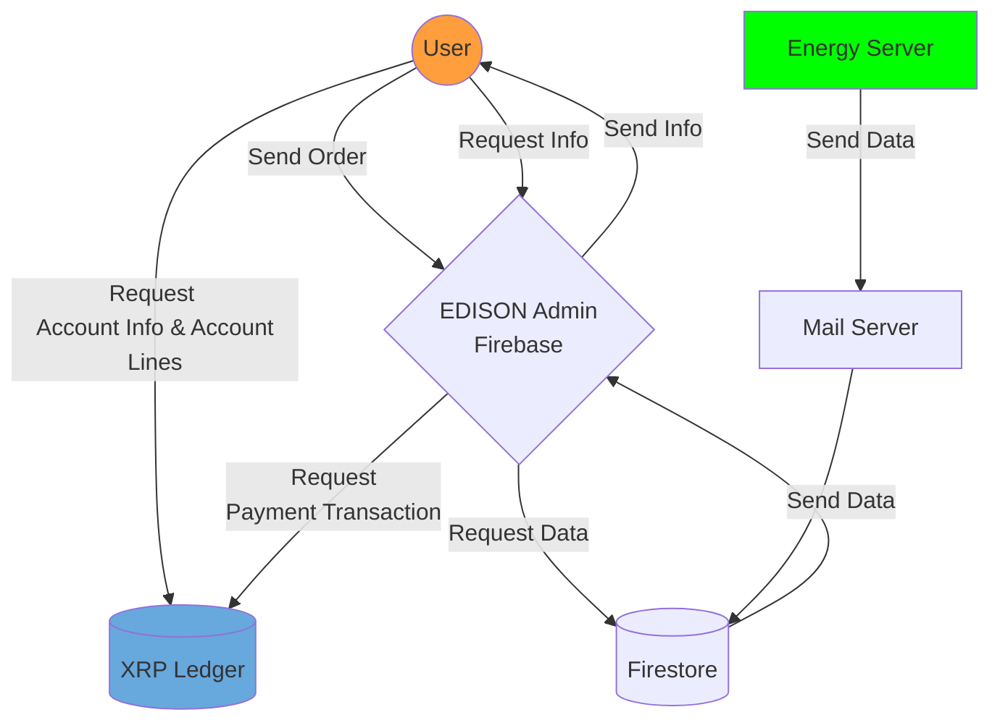

# ハードウェア構成図

```mermaid
flowchart
style User fill:#ff9e3d
style XRPL fill:#67a8dd
style ES fill:#00ff00


User((User)) -->|Send Order| Fn{EDISON Admin \n Firebase}
User((User)) -->|Request Info| Fn{EDISON Admin \n Firebase}
Fn{EDISON Admin \n Firebase} --> |Send Info|User
User --> |Request \n Account Info & Account Lines|XRPL[(XRP Ledger)]
Fn-->|Request \n Payment Transaction|XRPL
Fn -->|Request Data|DB[(Firestore)]
DB -->|Send Data| Fn
ES[Energy Server] -->|Send Data| MS[Mail Server]
MS-->DB
```
