# EDISON アップデート 2022/06/30

2022/06/30 [株式会社 CauchyE](https://cauchye.com/) 大村瀬奈 作成

## 概要

2022 年 7 月 1 日より京都大学大学院総合生存学館の合宿型研修施設にてシステム実証実験を開始して，2022 年度末まで実施する。

それに先立って，以下のアップデートを実施する。

## アップデート一覧

### (1)仕様書

(#は GitHub(<https://github.com/KyotoUniv-SIC/electoric-power-exchange>)でのプルリクエストの番号)

- 1. Token 管理の再設計（整数値に変更）<span style="color: blue; ">#255, #257</span>

  - 精度，計算速度の改善

- 2. 太陽光パネルの発電電力量データの読み込み <span style="color: blue; ">#265</span>

  - 関連してオークションと電力使用データ反映の時間を変更

- 3. 注文履歴の保存とダウンロード <span style="color: blue; ">#238，#261</span>

  - 成約した取引のみでのダウンロードも可能に

- 4. 電力価格インフレの改善

  - 約定価格と約定電気量の日時時系列を表示（27 JPY/kWh を赤の水平線で表示）<span style="color: blue; ">#262</span>
  - 価格乖離時の市場介入の実装 <span style="color: blue; ">#260</span>
    - 管理者ページからオンオフなどの設定変更を可能に
    - 介入状況の Dashboard への表示 <span style="color: blue; ">#266</span>

- 5. SPX 購入のインセンティブ付与 <span style="color: blue; ">#277</span>

  - Dashboard への CO2 ランキング通知（本人分のみ）

- 6. 初期トークンの付与

  - 先月の実績を基に付与するという発注のため，アカウント作成時に部屋番号の入力フィールドを設けた <span style="color: blue; ">#259</span>

- 7. 月末の処理の追加 <span style="color: blue; ">#277</span>
  - 使用推定量を超えた学生への警告メッセージ
  - 電力使用量と CO2 排出の平均値と当該アカウントの実績値を表示
  - 請求電気料金の表示

### (2)仕様書外の軽微な変更

- 8. UI の改善
  - 機能強化された Dashboard のデザイン変更 #269
  - Dashboard のデザイン変更に伴うアカウント詳細画面の変更 #277
  - 上記と関連したボタンなどの色の変更（色で機能をわかりやすく）#234
  - Insufficient Balance（残高不足）の表示をわかりやすく#247

## アップデートの詳細

### 1. Token 管理の再設計

すべての Token は小数点以下を所要した値となっており，1UPX (SPX) = 1kWh となっていた。この設計で現在，小数点以下の丸め誤差が発生していたため，トークン数を 10^6 倍し，小数点以下切り捨てで実装することで精度と計算速度を改善した。
この変更を電気使用量及び日本円の処理にも適用し，計算速度の改善を行った。

- データベースでの管理例（UPX 売り注文のヒストリーデータ）
  

### 2. 太陽光パネルの発電電力量データの読み込み

東一条館の太陽光パネルの発電量をメールで取得し，それをデータベースに反映し，同量の SPX トークンを発行する実装を行った。
また，これに並行し，シングルプライスオークションの実施時間と前日の電気使用実績分のトークン残高への反映の時間を変更し，注文のダウンタイムの時間を改善した。

以下に詳細を說明する。

#### 変更前

```

0:00 シングルプライスオークションの実施
9:10-15 エネルギーサーバーからのメール配信
10:00-11:00 メールの EDISON サーバーへの反映とトークン残高への反映
12:00 システムの介入（注文の発行）

毎月 1 日 9:00 月末精算の実施
```

このため，前回のテストでは 0:00 - 11:00 は売り注文のダウンタイムとしていた。

これを以下のような仕様に変更する。

#### 変更後

```
9:00 シングルプライスオークションの実施
9:10-15 エネルギーサーバーからのメール配信
9:30 前日分の電気使用実績のトークン残高への反映
10:00 システムの介入（注文の発行）
10:00-11:00 メールの EDISON サーバーへの反映

毎月 1 日 9:45 月末精算の実施
```

このように変更することで精算に最終日のオークション結果と電気使用実績の反映後のトークン残高を含めることができ，かつ，注文のダウンタイムを減らすことに成功した。
また，電気使用実績のトークン残高への反映がメールの EDISON サーバー反映のおよそ 23 時間前となったことで，ユーザーが電気使用実績を確認することが可能になり，それを踏まえた市場での注文が行えるようになった。

ダウンタイムは 7 月のテストでは 9:00-11:00 の 2 時間を予定しており，最初の 1 時間は Function の動作のため，後ろ 1 時間は バグ修正のためメンテナンスの時間とする。
10:00-11:00 のダウンタイムは将来的な廃止も可能である。

### 3. 注文履歴の保存とダウンロード

売り注文 (Bid)と買い注文 (Ask)の以下の情報を History データとしてデータベースに記録する仕様とした。csv 形式でフロントエンドから取得可能であり，グラフ等の作成に使用できる。

- 注文に固有の ID
- 注文を作成したユーザー（管理者）の ID
- 注文を作成したユーザーの名前（管理者の場合は'admin'）
- 注文の価格（日本円）
- 注文のトークン量
- 成約したかどうか
- 成約価格（日本円）
- 注文が作成された日時

管理者の Dashboard からこれのダウンロードが可能である。取得する注文の期間と成約した取引のみを対象とするかを選択可能である。

- Admin Dashboard 内のダウンロード機能
  

- データ(CSV)のサンプル

```dotnetcli
bid_id,account_id,account_name,price,amount,contract,contract_price,timestamp
0vvh18vQFBR6qONNNRY5,nBsB8mhqluAWpoFhyP0G,t01,27.8,6,YES,27.5,2022/6/1 19:52:45
4XYGzNZYMX5BSiqN8hKm,51eA4INK38NZGKDF1hfS,t02,27.5,2,NO,27.5,2022/6/1 19:35:42
IntCNtZVmkPge7PDxsOO,TQL3aixaTsdTqPF3hRIe,t03,28,10,NO,NaN,2022/6/2 20:12:40
MF6p31ovLMzO9QIXRqCY,51eA4INK38NZGKDF1hfS,t04,27.5,3,YES,27.5,2022/6/1 19:35:42
Pv0zInuTAoAl1WC6bz7Y,51eA4INK38NZGKDF1hfS,t04,27.8,1,YES,27.5,2022/6/1 19:29:17
VubNwYpxy7tWANMUwuDD,nBsB8mhqluAWpoFhyP0G,t01,27.8,2,YES,27.5,2022/6/1 19:52:45
d6S0TXIIj0LvyDuPmUfE,nBsB8mhqluAWpoFhyP0G,t01,27.8,2,YES,27.5,2022/6/1 19:52:45
dtaJfPfTjGgCYIu7tLpx,51eA4INK38NZGKDF1hfS,t04,27.4,1,NO,27.5,2022/6/1 19:29:59
meHYOTXA9Xgq3ChZeicD,51eA4INK38NZGKDF1hfS,t04,27.5,5,YES,27.5,2022/6/1 19:35:42
oZ0Q1didqLWw1dh6Mu33,nBsB8mhqluAWpoFhyP0G,t01,26,10,NO,27.5,2022/6/1 19:41:13
qcfVzztxVlC6bicFcekS,TQL3aixaTsdTqPF3hRIe,t03,27.6,3,YES,27.5,2022/6/1 19:51:09
```

### 4. 電力価格のインフレーションの改善

トークン価格インフレを抑えるために以下 2 つの機能を実装した。

- UPX 価格と約定電力量の日時時系列を表示する。グラフに目安として 27JPY/kWh を表示する。
- 価格高騰時のシステムからの市場介入を実装する。フロントエンドに介入状況を表示する。介入のオン・オフをフロントから切り替え可能にする。

#### (1)約定価格と約定電気量の日時時系列を表示

Dashboard に実装した。横軸を日時，縦軸を価格（左）と量（右）とし，過去 8 日間分を表示している。

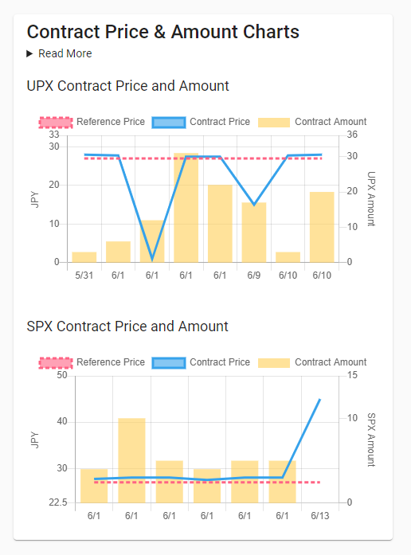

#### (2)価格乖離時の市場介入の実装

価格乖離時の市場介入について実装を行った。UPX のシステムからの注文のみがこれに対応し，SPX は発電量に応じて売り注文が発行される。この処理は毎日 10:00 に行われる。

ソースコードは以下である。
<https://github.com/KyotoUniv-SIC/electoric-power-exchange/blob/main/functions/src/schedules/operation-normal.ts>
処理は以下のフローに従う。

- 価格を決定する。
  - 月初 1 日である場合，27 円となる。
  - 管理者が設定した場合その価格に，何もしていない場合は前日の介入+0.1 円となる。
- 当日の価格のデルタ（階差）の絶対値がしきい値を下回る場合，売り注文，買い注文それぞれのデルタをサーバーに保存し，以下の介入は発生しない。
- 価格のデルタが正の場合，1 の処理，負の場合は 2 のフローに従う

1. (過去の売り注文のデルタの平均値 - 当日の売り注文のデルタ)と(当日の買い注文のデルタ - 過去の買い注文のデルタの平均値)の値の大小を比較し，大きい値を取る方を発行トークン量とし，売り注文を行う。
2. (過去の買い注文のデルタの平均値 - 当日の買い注文のデルタ)と(当日の売り注文のデルタ - 過去の売り注文のデルタの平均値)の値の大小を比較し，大きい値を取る方を発行トークン量とし，買い注文を行う。

これらは管理者ページより介入の有無を含めた設定変更が可能であり，介入の状況についてはユーザーが Dashboard 上で確認することができる。

- 管理者用設定変更ページ
  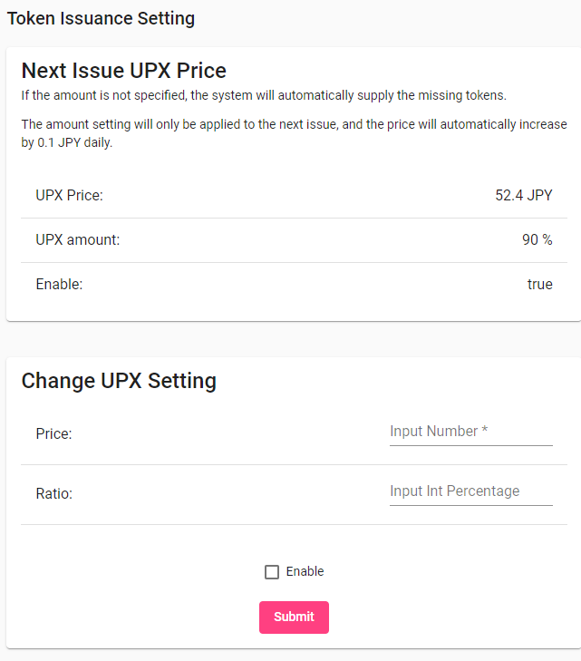

- Dashboard 内介入状況表示
  

### 5. SPX 購入のインセンティブ付与

フロントエンドに現在の CO2 排出量 (UPX 使用量)のランキングを通知し，下位 3 名に少額の賞金を与えて表彰する。この賞金と表彰をインセンティブとする。

Dashboard に CO2 ランキングの自分の順位を表示する機能を追加した。

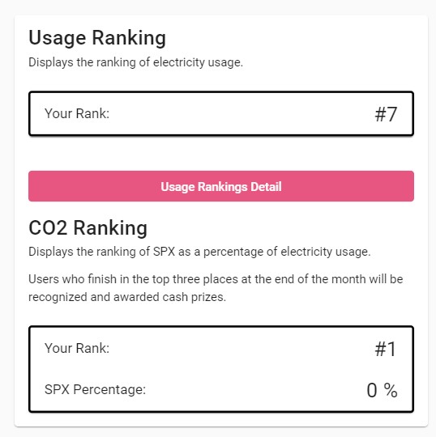

### 6. 初期トークン付与

アカウント作成時に部屋番号を要求し，その部屋番号の先月の電気使用量を基準にトークン付与量を決定する実装を行った。このため，アカウント作成時に部屋番号の入力を求める実装を行った。

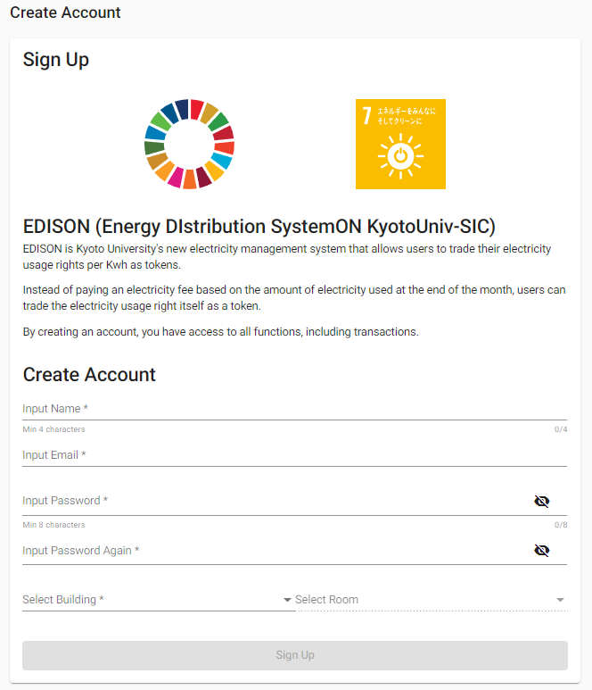

### 7. 月末の処理の追加

月末の処理について，以下の 3 点を追加で実装した。月末処理は毎月 1 日 9:45 に行われる。

- 使用推定量を超えた学生への警告メッセージ
- 電力使用量と CO2 排出の平均値と当該アカウントの実績値の通知
- 請求電気料金の表示

#### (1)使用推定量を超えた学生への警告メッセージ

Dashboard 内の当月の電気使用量を表示する箇所に，すでに使用量が前月の実績を超えている場合に警告文を表示する機能の実装を行った。

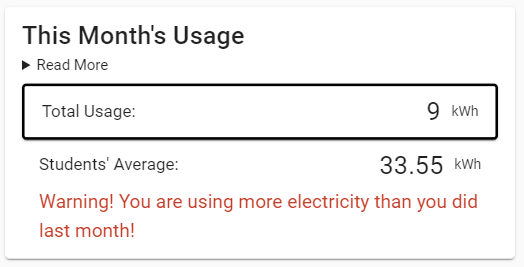

#### (2)電力使用量と CO2 排出量と当該アカウントの実績値の通知

Dashboard 内に先月の電気使用量、CO2 排出量の 2 つについて、実績値とユーザー全体の平均値を表示する機能の実装を行った。

- 表示のサンプル
  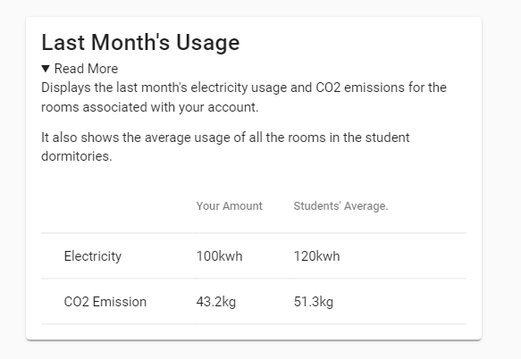

#### (3)請求電気料金の表示

アカウント詳細ページより過去一年間の実績が確認できるよう実装を行った。

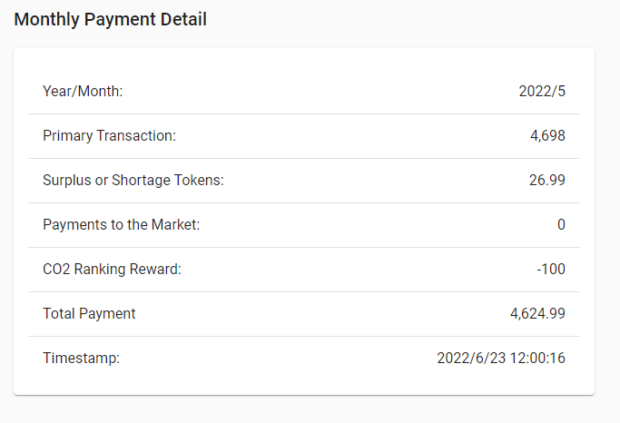

### 8. UI の改善

- 機能強化された Dashboard のデザイン変更
- Dashboard のデザイン変更に伴うアカウント詳細画面の変更
- 上記と関連したボタンなどの色の変更
- Insufficient Balance（残高不足）の表示の変更

#### (1)機能強化された Dashboard のデザイン変更

ここまでの変更により Dashboard の表示内容が増えたため，表示内容の改善を行った。

- デスクトップ・ラップトップでの画面面積あたりの表示を質・量ともに改善した。
- モバイルでの表示を省略（詳細表示はボタンで遷移）し，ユーザーが求められるスクロールの回数を抑えた。
- 使用量の月次データ（前年比）のグラフについては
  ①Dashboard の煩雑化を避けるため，
  ② 請求金額が表示されるアカウント詳細画面に表示されることが望ましいため，
  アカウント詳細画面での表示に変更した。

- デスクトップ or ラップトップ
  

- モバイル
  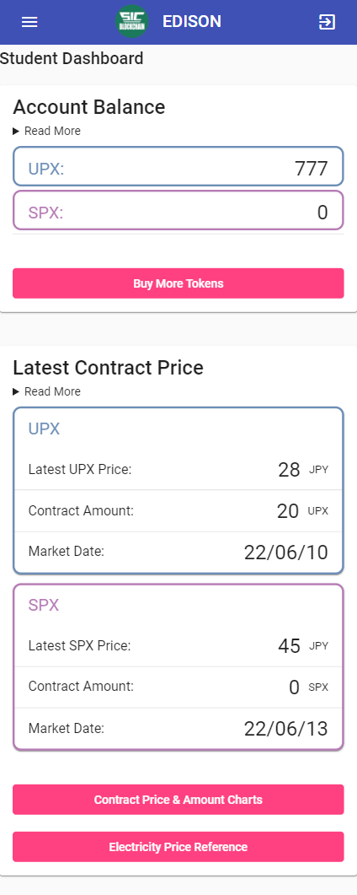 | 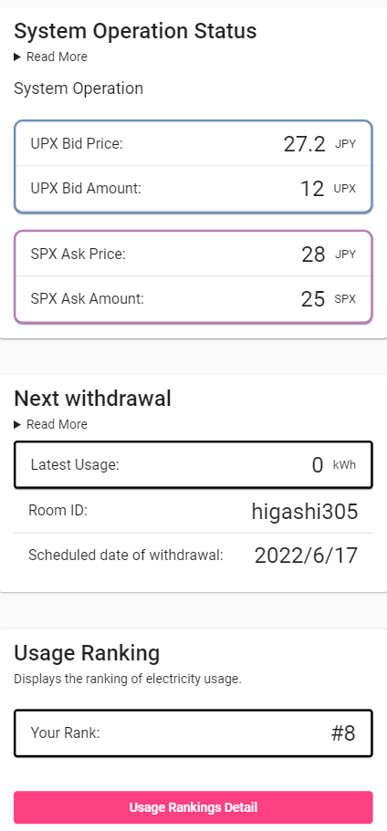 | 

#### (2)Dashboard のデザイン変更に伴うアカウント詳細画面の変更

アカウント詳細画面では精算された請求金額が表示されていたが，これに加えて，以前のバージョンでは Dashboard に表示していた使用量の月次データ（前年比）のグラフを表示する変更を行った。

- モバイルでの表示例（ラップトップ等ではセンターに表示）
  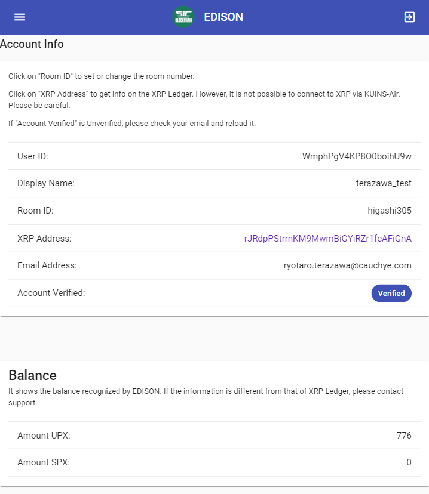 

#### (3)カラーリングの調整

UPX と SPX，Bid と Ask などが直感的にわかりやすいようにボタンや表示の色を改善した。

- 変更前
  
- 変更後
  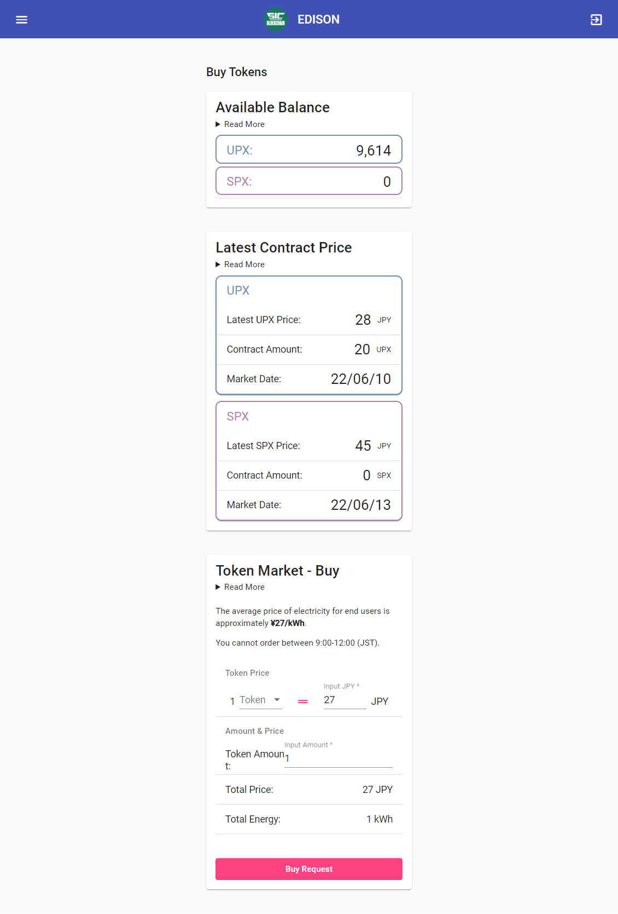

#### (4)残高不足の表示の改善

残高が存在する場合に，Insufficient Balance (残高不足)が表示される仕様がわかりにくいというフィードバックを受けたことを踏まえて，EDISON の WEB アプリ上では Insufficient Balance を計算に含めたトークン残高を表示する変更を行った。

一方で，XRP Ledger の残高 > EDISON で表示されている残高となるケースが発生することから XRP Ledger での残高を表示するページでは今まで通りのトークン残高を表示している。

- EDISON で表示される残高の例
  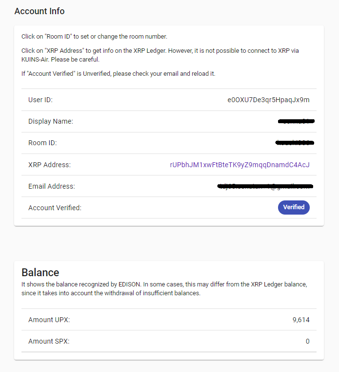

- XRP Ledger の残高を確認するページ
  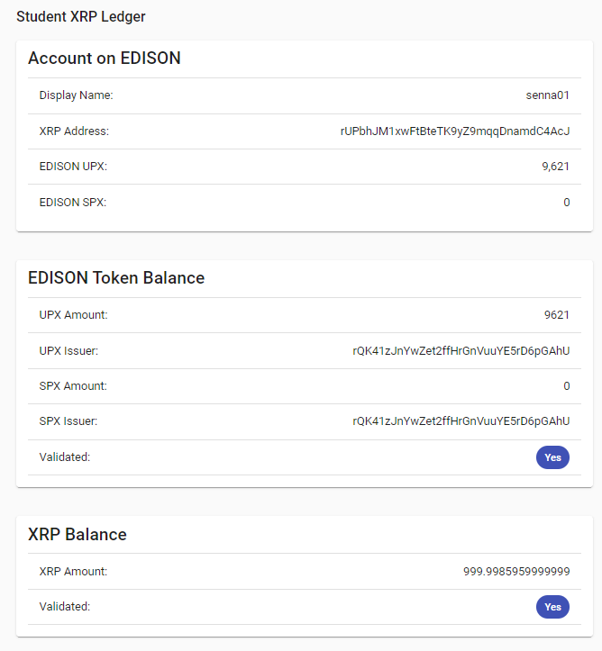
